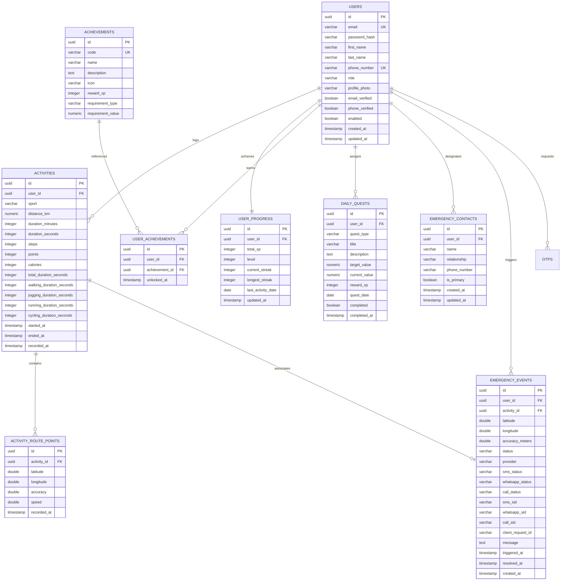

# StrideMate — Software Design Document

**Document Version:** 1.0.0 (Submission Baseline)  
**Target Platform:** Full-Stack Athlete Tracking, Gamification, Environmental Intelligence & Safety Ecosystem  
**Backend Framework:** Spring Boot 3.5.0 (Java 21 LTS) & Spring Security (Stateless JWT)  
**Frontend Framework:** React 18+ (TypeScript, Vite, Tailwind CSS, Leaflet)  
**Database:** PostgreSQL (Supabase / In-Memory H2 for Test Isolation)

---

## 1. Executive Summary

### 1.1 Project Overview
**StrideMate** is a full-stack, cloud-ready fitness and endurance activity tracking web application. It combines real-time outdoor GPS telemetry, velocity-based activity segmentation, algorithmic metric normalization, a deterministic quadratic gamification engine, live environmental microclimate intelligence, OpenStreetMap-powered smart running venue discovery, interactive GPS route playback, and a safe mock emergency SOS safety protocol.

### 1.2 Purpose & Engineering Goals
The core engineering objective of StrideMate is to provide an authoritative, transparent, and responsive platform that solves the common pitfalls of fitness applications:
1. **Server-Authoritative Ingestion & Scoring:** Preventing client-side telemetry manipulation by enforcing strict server-side validation, coordinate bounds checking, and mathematical normalization formulas.
2. **Deterministic Gamification:** Providing transparent progression mechanics through quadratic level curves ($50 + 50N$ XP delta per level), UTC-consistent daily streak tracking, dynamic daily quests, and non-repeatable milestone achievements.
3. **Environmental Contextualization:** Correlating athlete workouts with real-time Air Quality Index (AQI), PM2.5, PM10, UV, temperature, and wind data.
4. **Smart Spatial Discovery:** Leveraging OpenStreetMap Overpass spatial queries to discover nearby parks, running tracks, and trails with traffic-aware running suitability scoring.
5. **Safety Architecture:** Implementing an emergency SOS workflow featuring a 1.5-second hold-to-confirm interaction, GPS coordinate locking, primary contact resolution, 5-minute idempotency guards, and a provider-agnostic notification architecture operating in safe development mock mode.

### 1.3 Technology Stack

```
Frontend:
├── Core: React 18+ with TypeScript (Strict Mode)
├── Build Tool: Vite 8.x
├── Styling: Tailwind CSS & Lucide Icons (Vanilla CSS Token System)
├── Spatial / Maps: Leaflet 1.9+ & React-Leaflet
├── HTTP Client: Axios 1.7+ with Request/Response Interceptors
└── State / Routing: React Context API, Custom React Hooks, React Router DOM v6

Backend:
├── Framework: Spring Boot 3.5.0 (Java 21 LTS)
├── Security: Spring Security 6.x (Stateless SessionCreationPolicy, BCrypt, JJWT 0.12.x)
├── Data Access: Spring Data JPA & Hibernate ORM
├── Persistence: PostgreSQL (Supabase) & In-Memory H2 (Unit / Integration Tests)
├── JSON Serialization: Jackson with JavaTimeModule
└── Quality Assurance: JUnit 5, Spring Boot Test, MockRestServiceServer, Mockito

Database:
├── Schema Engine: PostgreSQL 15+ (Supabase)
└── Migration Strategy: Idempotent SQL Scripts (Phases 3–10) with IF NOT EXISTS DDL
```

---

## 2. Project Scope — Required Features vs Additional Features

### 2.1 Required Features (Evaluation Baseline)
The following core requirements from the project specification are fully implemented, server-authoritative, and verified by automated test suites:

1. **User Registration & Validation:** Implemented in `Register.tsx` and `AuthService.java` (`POST /api/auth/register`). Validates first name, last name, RFC-5322 email format, and password complexity rules (min 8 chars, letter, number, special char).
2. **Activity Data Ingestion:** Implemented in `ActivityController.java` and `ActivityService.java` (`POST /api/activities`). Validates positive distance/duration bounds, auto-populates durations, and executes server-authoritative scoring.
3. **Database / Relational Data Model:** Implemented in PostgreSQL schema with foreign keys, composite indexes, and `ON DELETE CASCADE` referential integrity across users, activities, route points, progress, quests, achievements, and emergency contacts.
4. **Global Leaderboard:** Implemented in `LeaderboardController.java` and `LeaderboardService.java` (`GET /api/leaderboard`). Aggregates total XP, points, and activity counts across All-Time, Weekly, and Monthly time frames.
5. **Personal Dashboard:** Implemented in `Dashboard.tsx` and `DashboardService.java` (`GET /api/dashboard`). Visualizes total distance, active time, calories, current level, progress bar, daily quest cards, and recent workouts.
6. **Authoritative Scoring & Ranking:** Implemented in `ScoringService.java`. Authoritative point calculation for running, walking, cycling, swimming, gym, and steps.
7. **Metric Normalization:** Implemented in `ScoringService.java`. Translates raw durations, distances, and steps into standardized scoring units.
8. **Distance Conversion & Flooring:** Implemented in `ScoringService.java` via `BigDecimal.setScale(0, RoundingMode.FLOOR)`:
   - Running: $\lfloor \text{distanceKm} \times 100 \rfloor$
   - Walking: $\lfloor \text{distanceKm} \times 50 \rfloor$
   - Cycling: $\lfloor \text{distanceKm} \times 25 \rfloor$
9. **Duration Conversion & Flooring:** Implemented in `ScoringService.java`:
   - Swimming: $\lfloor \text{totalSeconds} / 60 \rfloor \times 15$
   - Gym: $\lfloor \text{totalSeconds} / 60 \rfloor \times 5$
10. **100-Step Block Calculation:** Implemented in `ScoringService.java` using integer division `steps / 100 * 1` (strictly flooring to 100-step intervals).
11. **Duplicate User Detection:** Implemented in `AuthService.java` (`userRepository.existsByEmailIgnoreCase`) and enforced via database unique constraints on `public.users(email)` and `public.users(phone_number)`. Returns `409 Conflict`.
12. **Validation & Error Handling:** Implemented in `GlobalExceptionHandler.java`. Handles validation errors, entity not found, access violations, duplicate resources, and invalid coordinates with structured JSON error responses.

---

### 2.2 Additional Features Implemented (Beyond Baseline)

1. **Activity History & Deep Workouts Explorer:** Complete workout log filtering by sport, date, duration, and calories with pagination and route inspection (`ActivityHistory.tsx`).
2. **Fitness Analytics & Volume Charts:** Time-series charts visualizing weekly activity volume, distance distributions, calorie burn, and sport percentage splits (`Analytics.tsx`).
3. **Advanced Gamification System:**
   - **Quadratic Level Progression Curve:** Deterministic curve requiring $50 + 50N$ XP for level $N \to N+1$ (`GamificationService.java`).
   - **Daily Streaks & 7-Day Consistency Calendar:** Evaluates workouts across UTC calendar days and populates a 7-day consistency ring.
   - **Daily Quests Engine:** Automatically generates 3 personalized quests daily (distance, calorie, point targets) with bonus XP rewards.
   - **12 Milestone Achievements:** One-time milestone badges (`FIRST_STRIDE`, `STREAK_7`, `MARATHON_DISTANCE`, `CENTURION_100K_STEPS`, etc.).
   - **Level-Up Celebration Pipeline:** Interactive confetti and badge celebration modal on level advancement.
4. **Environmental Intelligence Engine:** Real-time AQI, PM2.5, PM10, UV, temperature, and wind metrics with composite Running Suitability Scoring ($0\text{--}100$) (`EnvironmentService.java`).
5. **Smart Running Map:** OpenStreetMap Overpass spatial queries discovering nearby parks, tracks, and trails within 5 km, integrated with TomTom traffic congestion overlays (`SmartRunningMap.tsx`).
6. **GPS Breadcrumb Persistence & Route Replay:** High-frequency GPS breadcrumbs (`ActivityRoutePoint`) stored in PostgreSQL, downsampled if $>1000$ points, and replayed via Leaflet with a timeline scrubber ($1\times, 2\times, 5\times$) and Start/Finish markers (`RouteViewer.tsx`).
7. **Route Privacy Protection:** Automatic start and end point obfuscation during social card sharing to hide athlete residential or workplace coordinates.
8. **Social Activity Share Cards:** Dynamic share card generator integrating workout stats, map snippet, streak count, and Web Share API / clipboard fallback (`ShareActivityCard.tsx`).
9. **Custom Profile & Avatar System:** Animal cartoon avatar selector (6 friendly SVGs) and custom image upload supporting secure local disk storage and MIME validation (`Profile.tsx`).
10. **Unified StrideLoader:** Theme-adaptive pulsing SVG polyline animation utilized across all data-fetching views (`StrideLoader.tsx`).
11. **Safety & SOS Workflow:** 1.5-second hold-to-confirm trigger, GPS coordinate lock, primary contact resolution, 5-minute idempotency guard, incident logging, and provider-agnostic notification architecture operating in safe mock mode (`Safety.tsx`).

---

## 3. Feature Verification Matrix

| Feature | Scope | Implementation Component | Status | Notes / Verification Evidence |
| :--- | :--- | :--- | :--- | :--- |
| **User Registration** | `Required` | `Register.tsx`, `AuthService.java` | `WORKING / VERIFIED` | Verified by `AuthControllerTest.java` (Tests 1-8). Validates duplicate email/phone. |
| **Duplicate User Detection**| `Required` | `AuthService.java`, DB unique constraints | `WORKING / VERIFIED` | Verified by `AuthControllerTest.java`. Returns 409 Conflict. |
| **Activity Ingestion** | `Required` | `AddActivity.tsx`, `ActivityService.java` | `WORKING / VERIFIED` | Verified by `ActivityControllerTest.java` & `RouteAndSafetySprintTest.java`. |
| **Distance Flooring** | `Required` | `ScoringService.java` | `WORKING / VERIFIED` | Verified by `ScoringServiceTest.java`. Floor math with `BigDecimal`. |
| **Duration Flooring** | `Required` | `ScoringService.java` | `WORKING / VERIFIED` | Verified by `ScoringServiceTest.java`. Integer minute division. |
| **100-Step Block Scoring** | `Required` | `ScoringService.java` | `WORKING / VERIFIED` | Verified by `ScoringServiceTest.java`. `steps / 100 * 1`. |
| **Global Leaderboard** | `Required` | `Leaderboard.tsx`, `LeaderboardService.java`| `WORKING / VERIFIED` | Verified by `LeaderboardControllerTest.java`. All/Week/Month views. |
| **Personal Dashboard** | `Required` | `Dashboard.tsx`, `DashboardService.java` | `WORKING / VERIFIED` | Verified by `DashboardControllerTest.java`. |
| **Error Handling** | `Required` | `GlobalExceptionHandler.java` | `WORKING / VERIFIED` | Standardized JSON error response schema. |
| **Live GPS Tracking** | `Extra` | `AddActivity.tsx`, `useGeoTracker.ts` | `WORKING / VERIFIED` | Uses HTML5 Geolocation API with high accuracy mode. |
| **Simulator Mode** | `Extra` | `AddActivity.tsx`, `useGeoTracker.ts` | `WORKING / VERIFIED` | Simulates live jogging telemetry for desktop testing. |
| **Telemetry Segmentation** | `Extra` | `useGeoTracker.ts`, `ScoringService.java` | `WORKING / VERIFIED` | Weighted speed factor partitioning ($w_{\text{walk}}, w_{\text{jog}}, w_{\text{run}}, w_{\text{cycle}}$). |
| **Route Point Persistence** | `Extra` | `ActivityRoutePoint.java`, `ActivityService` | `WORKING / VERIFIED` | Verified by `RouteAndSafetySprintTest.java`. |
| **Leaflet Route Replay** | `Extra` | `RouteViewer.tsx` | `WORKING / VERIFIED` | Interactive timeline scrubber with speed multipliers ($1\times, 2\times, 5\times$). |
| **Privacy Route Trimming** | `Extra` | `ActivityService.java`, `ShareCard.tsx` | `WORKING / VERIFIED` | Verified by `RouteAndSafetySprintTest.java`. Obscures start/end points. |
| **Social Share Cards** | `Extra` | `ShareActivityCard.tsx` | `WORKING / VERIFIED` | Web Share API with clipboard fallback. |
| **XP & Level Progression** | `Extra` | `GamificationService.java` | `WORKING / VERIFIED` | Verified by `GamificationServiceTest.java`. Quadratic curve $25(N-1)(N+2)$. |
| **Streaks & 7-Day Calendar**| `Extra` | `GamificationService.java` | `WORKING / VERIFIED` | Verified by `GamificationServiceTest.java`. Evaluates UTC calendar dates. |
| **Daily Quests Engine** | `Extra` | `GamificationService.java` | `WORKING / VERIFIED` | 3 quests auto-generated daily with reward XP. |
| **Achievements System** | `Extra` | `GamificationService.java` | `WORKING / VERIFIED` | 12 milestone badges with reward XP. |
| **Activity History** | `Extra` | `ActivityHistory.tsx` | `WORKING / VERIFIED` | Filtering by sport, date, calories, duration. |
| **Fitness Analytics** | `Extra` | `Analytics.tsx`, `AnalyticsService.java` | `WORKING / VERIFIED` | Weekly volume and sport breakdown aggregation. |
| **Cartoon Animal Avatars** | `Extra` | `Profile.tsx`, `UserService.java` | `WORKING / VERIFIED` | 6 friendly SVG animal presets. |
| **Profile Photo Upload** | `Extra` | `Profile.tsx`, `UserService.java` | `WORKING / VERIFIED` | Local disk storage (`/uploads/avatars`) with MIME validation. |
| **Unified StrideLoader** | `Extra` | `StrideLoader.tsx` | `WORKING / VERIFIED` | Theme-adaptive SVG polyline animation. |
| **Light & Dark Theme** | `Extra` | `App.tsx`, `index.css` | `WORKING / VERIFIED` | Instant token swapping via CSS variables. |
| **Environmental Weather/AQI**| `Extra`| `EnvironmentService.java` | `IMPLEMENTED — CONFIGURATION REQUIRED` | Live OpenWeather API when key present; deterministic microclimate simulation fallback in dev. |
| **Smart Running Map** | `Extra` | `SmartMapService.java`, `SmartRunningMap`| `IMPLEMENTED — CONFIGURATION REQUIRED` | Live OpenStreetMap Overpass queries for parks; TomTom traffic overlay when key present. |
| **Emergency Contacts CRUD** | `Extra` | `EmergencyContactService.java`, `Safety` | `WORKING / VERIFIED` | Primary contact enforcement; user ownership isolation. |
| **SOS Dispatch (Mock Mode)** | `Extra` | `SafetyService.java`, `MockProvider` | `WORKING / VERIFIED` | Safely simulates SMS delivery (`MOCK_SENT`) without telco costs. |
| **SOS Dispatch (Real Mode)** | `Extra` | `SpringEdgeNotificationProvider.java` | `IMPLEMENTED — CONFIGURATION REQUIRED` | Real SpringEdge REST SMS adapter prepared; inactive in submission mode. |
| **SOS Webhook / DLR Status** | `Extra` | `SafetyController.java`, `SafetyService` | `WORKING / VERIFIED` | Verified by `SpringEdgeSosRealSprintTest.java`. Updates status to `DELIVERED`. |
| **SOS WhatsApp & Voice** | `Extra` | `SpringEdgeNotificationProvider.java` | `IMPLEMENTED — MOCK` | Correctly returns `UNAVAILABLE` when sender unconfigured. |

---

## 4. SOS / Emergency Safety Status (Safe Submission Mode)

> [!IMPORTANT]
> ### Safe Development & Evaluation Baseline
> The StrideMate SOS system is engineered as an end-to-end safety workflow and notification provider abstraction. For this project submission, the system is **intentionally configured in `MOCK / SIMULATED DELIVERY` mode** (`NOTIFICATION_PROVIDER_MODE=mock`).
>
> **Why Real Delivery is Disabled by Default:**
> - Real SMS dispatch to Indian cellular networks via SpringEdge requires an active enterprise subscription, prepaid SMS credits, and registered DLT (Distributed Ledger Technology) headers/templates per TRAI telecommunications compliance.
> - Simulating delivery prevents accidental cellular network costs and ensures evaluators can execute the full safety lifecycle without external provider credentials.
>
> **The Complete Workflow Operates End-to-End in Mock Mode:**
> 1. **Accidental Trigger Prevention:** The athlete must hold the SOS button for **1.5 seconds**, tracked via an animated radial SVG countdown.
> 2. **GPS Coordinate Locking:** Acquires high-accuracy GPS coordinates and validates bounds strictly ($\text{lat} \in [-90, 90]$, $\text{lon} \in [-180, 180]$, no NaN/Infinity).
> 3. **Primary Contact Resolution:** Resolves the athlete's designated primary emergency contact. Fails with `NO_PRIMARY_CONTACT` if none is configured.
> 4. **Idempotency Guard:** Checks `clientRequestId` within a 5-minute window; returns the existing incident instantly without creating duplicate records.
> 5. **Incident Recording:** Persists an `EmergencyEvent` record in PostgreSQL with generated Google Maps link (`https://www.google.com/maps?q={lat},{lon}`).
> 6. **Simulated Delivery Result:** Returns `MOCK_SENT` with simulated message SID (`mock-sms-xxx`), updating the UI badge to `SIMULATED DELIVERY (DEV MOCK)`.
> 7. **Incident History:** The logged emergency event is immediately visible in the athlete's Safety Incident History table.

---

## 5. System Architecture & Data Flow

```mermaid
flowchart LR
    U[Athlete / Mobile & Desktop Browser]
    FE[React 18 + TypeScript + Vite SPA]
    API[Spring Boot 3.5.0 REST API]

    subgraph SecurityLayer ["Security & Authentication Layer"]
        CORS[CORS Policy Filter]
        JWT[JwtAuthenticationFilter]
        SEC[Spring Security RBAC]
    end

    subgraph CoreServices ["Backend Application Services"]
        AUTH[AuthService & OtpService]
        ACT[ActivityService & ScoringService]
        GAM[GamificationService]
        ANA[AnalyticsService]
        LEAD[LeaderboardService]
        ENV[EnvironmentService & SmartMapService]
        SAFE[SafetyService & DelegatingProvider]
    end

    subgraph DataStorage ["Persistence Layer"]
        DB[(Supabase PostgreSQL)]
        DISK[(Local Disk /uploads)]
    end

    subgraph ExternalProviders ["External Services & APIs"]
        EXT1[OpenWeatherMap API / Microclimate Engine]
        EXT2[OpenStreetMap Overpass API]
        EXT3[TomTom Traffic Flow API]
        EXT4[OpenStreetMap Tile Server]
        MOCK[MockNotificationProvider (Submission Default)]
        SE[SpringEdge REST SMS Gateway (Config-Dependent)]
    end

    U --> FE
    FE --> API
    API --> CORS --> JWT --> SEC
    SEC --> CoreServices

    AUTH --> DB
    ACT --> DB
    GAM --> DB
    ANA --> DB
    LEAD --> DB
    SAFE --> DB
    CoreServices --> DISK

    ENV --> EXT1
    ENV --> EXT2
    ENV --> EXT3
    FE --> EXT4

    SAFE --> MOCK
    SAFE -.->|Optional Real Mode| SE
```

---

## 6. Database Schema & Data Model

The PostgreSQL schema is partitioned into modular operational domains with cascading referential integrity.



---

## 7. API Specifications

### 7.1 Authentication Endpoints

#### `POST /api/auth/register`
- **Purpose:** Registers a new athlete and sends a 6-digit email OTP.
- **Request Payload:**
  ```json
  {
    "firstName": "Siddharth",
    "lastName": "Verma",
    "email": "siddharth@example.com",
    "password": "Password123!",
    "phoneNumber": "+919876543210"
  }
  ```
- **Validation Rules:**
  - `firstName`, `lastName`: Required, non-blank, max 50 characters.
  - `email`: Required, valid email format (case-insensitively checked for uniqueness).
  - `password`: Required, minimum 8 characters, at least 1 digit, 1 letter, 1 special character.
  - `phoneNumber`: Required, validated for uniqueness.
- **Success Response (201 Created):**
  ```json
  {
    "email": "siddharth@example.com",
    "message": "Registration successful. Please verify your OTP sent to email."
  }
  ```
- **Error Responses:** `400 Bad Request` (Validation errors), `409 Conflict` (Email or phone already registered).

#### `POST /api/auth/verify-otp`
- **Request:** `{ "email": "siddharth@example.com", "otp": "592814" }`
- **Response (200 OK):**
  ```json
  {
    "token": "eyJhbGciOiJIUzI1NiIsInR5cCI6IkpXVCJ9...",
    "user": {
      "id": "e8a9b0c1-2345-6789-abcd-ef0123456789",
      "email": "siddharth@example.com",
      "firstName": "Siddharth",
      "lastName": "Verma",
      "role": "USER",
      "profileCompleted": true
    }
  }
  ```

---

### 7.2 Activity Ingestion & GPS Route Endpoints

#### `POST /api/activities`
- **Purpose:** Ingests an activity with telemetry breakdown and GPS route points.
- **Request Payload:**
  ```json
  {
    "sport": "RUNNING",
    "distanceKm": 4.50,
    "durationMinutes": 25,
    "durationSeconds": 0,
    "steps": 5400,
    "totalDurationSeconds": 1500,
    "walkingDurationSeconds": 300,
    "joggingDurationSeconds": 600,
    "runningDurationSeconds": 600,
    "cyclingDurationSeconds": 0,
    "startedAt": "2026-08-18T10:00:00Z",
    "endedAt": "2026-08-18T10:25:00Z",
    "routePoints": [
      { "latitude": 12.9716, "longitude": 77.5946, "accuracy": 4.5, "speed": 2.8, "recordedAt": "2026-08-18T10:00:00Z" },
      { "latitude": 12.9725, "longitude": 77.5955, "accuracy": 3.8, "speed": 3.4, "recordedAt": "2026-08-18T10:05:00Z" }
    ]
  }
  ```
- **Response (200 OK):**
  ```json
  {
    "activity": {
      "activityId": "d1c2b3a4-5678-90ab-cdef-1234567890ab",
      "sport": "RUNNING",
      "distanceKm": 4.50,
      "points": 425,
      "calories": 298,
      "recordedAt": "2026-08-18T10:25:00Z"
    },
    "pointsEarned": 425,
    "xpEarned": 425,
    "currentXp": 950,
    "totalXp": 1650,
    "level": 5,
    "levelUp": false,
    "currentStreak": 3,
    "longestStreak": 5,
    "completedQuests": [],
    "unlockedAchievements": []
  }
  ```

#### `GET /api/activities/{id}/route?privacy=true`
- **Purpose:** Fetches GPS breadcrumb points for Leaflet map playback, with optional start/end privacy trimming.
- **Response (200 OK):**
  ```json
  {
    "activityId": "d1c2b3a4-5678-90ab-cdef-1234567890ab",
    "privacyTrimmed": true,
    "points": [
      { "latitude": 12.9720, "longitude": 77.5950, "accuracy": 4.0, "speed": 3.1, "recordedAt": "2026-08-18T10:02:00Z" }
    ]
  }
  ```

---

### 7.3 Safety & SOS Endpoints

#### `POST /api/safety/sos`
- **Purpose:** Initiates emergency alert workflow.
- **Request Payload:**
  ```json
  {
    "latitude": 12.971598,
    "longitude": 77.594562,
    "accuracyMeters": 5.0,
    "activityId": null,
    "clientRequestId": "client-sos-key-8899"
  }
  ```
- **Response (200 OK):**
  ```json
  {
    "eventId": "f9e8d7c6-b5a4-3210-9876-543210fedcba",
    "status": "ACCEPTED",
    "provider": "MOCK",
    "locationUrl": "https://www.google.com/maps?q=12.971598,77.594562",
    "sms": "MOCK_SENT",
    "whatsapp": "MOCK_SENT",
    "call": "MOCK_SENT",
    "smsSid": "mock-sms-f9e8d7c6",
    "contactName": "Ananya Sharma",
    "contactPhone": "+919876543210",
    "triggeredAt": "2026-08-18T10:35:00Z"
  }
  ```

#### `GET /api/safety/mode`
- **Purpose:** Returns current notification mode without exposing API keys.
- **Response (200 OK):**
  ```json
  {
    "mode": "mock",
    "isReal": false,
    "provider": "MOCK"
  }
  ```

---

## 8. Scoring & Normalization Logic

Authoritative scoring calculations are executed strictly server-side in [`ScoringService.java`](file:///C:/StrideMate/backend/src/main/java/com/stridemate/api/scoring/ScoringService.java).

### 8.1 Distance & Duration Point Formulas

$$\text{Points}_{\text{Running}} = \lfloor \text{distanceKm} \times 100 \rfloor$$
$$\text{Points}_{\text{Walking}} = \lfloor \text{distanceKm} \times 50 \rfloor$$
$$\text{Points}_{\text{Cycling}} = \lfloor \text{distanceKm} \times 25 \rfloor$$
$$\text{Points}_{\text{Swimming}} = \left\lfloor \frac{\text{totalSeconds}}{60} \right\rfloor \times 15$$
$$\text{Points}_{\text{Gym}} = \left\lfloor \frac{\text{totalSeconds}}{60} \right\rfloor \times 5$$
$$\text{Points}_{\text{Daily Steps}} = \left\lfloor \frac{\text{steps}}{100} \right\rfloor \times 1 \quad \text{(100-step floor blocks)}$$

### 8.2 Telemetry Auto-Segmented Scoring
When an outdoor session contains mixed velocities (walking, jogging, running, cycling), the total distance is dynamically partitioned across the segments using weighted speed factors:

$$w_{\text{walk}} = t_{\text{walk}} \times 4.5, \quad w_{\text{jog}} = t_{\text{jog}} \times 8.0, \quad w_{\text{run}} = t_{\text{run}} \times 12.0, \quad w_{\text{cycle}} = t_{\text{cycle}} \times 20.0$$
$$w_{\text{total}} = w_{\text{walk}} + w_{\text{jog}} + w_{\text{run}} + w_{\text{cycle}}$$
$$d_{\text{segment}} = \text{distanceKm} \times \left(\frac{w_{\text{segment}}}{w_{\text{total}}}\right)$$
$$\text{Total Points} = \lfloor d_{\text{walk}} \times 50 \rfloor + \lfloor d_{\text{jog}} \times 100 \rfloor + \lfloor d_{\text{run}} \times 100 \rfloor + \lfloor d_{\text{cycle}} \times 25 \rfloor$$

### 8.3 Calorie Formulas
$$\text{Calories}_{\text{Segmented}} = \text{round}\left( \frac{t_{\text{walk}}}{60} \times 4.5 + \frac{t_{\text{jog}}}{60} \times 8.5 + \frac{t_{\text{run}}}{60} \times 12.0 + \frac{t_{\text{cycle}}}{60} \times 8.0 \right)$$
$$\text{Calories}_{\text{Running Default}} = \text{round}(\text{distanceKm} \times 65.0)$$
$$\text{Calories}_{\text{Walking Default}} = \text{round}(\text{distanceKm} \times 45.0)$$
$$\text{Calories}_{\text{Cycling Default}} = \text{round}(\text{distanceKm} \times 30.0)$$
$$\text{Calories}_{\text{Steps Default}} = \text{round}(\text{steps} \times 0.04)$$

---

## 9. Frontend Architecture & Visualizations

### 9.1 Component Hierarchy & Route Structure
```
App.tsx (Theme Provider, Auth Provider, Router)
├── Navbar.tsx (Navigation HUD, Theme Toggle, Profile Avatar)
├── /dashboard -> Dashboard.tsx (Stats, Level Bar, Quests, 7-Day Consistency Ring)
├── /track -> AddActivity.tsx (Live GPS, Simulator, HUD, Telemetry Breakdown)
├── /history -> ActivityHistory.tsx (Workout Log, Filtering, Route Inspection)
├── /analytics -> Analytics.tsx (Weekly Volume Charts, Sport Percentage Splits)
├── /leaderboard -> Leaderboard.tsx (All-Time, Weekly, Monthly Ranks)
├── /map -> SmartMap.tsx (Overpass Parks, TomTom Traffic, Running Suitability)
├── /safety -> Safety.tsx (Emergency Contacts CRUD, 1.5s Hold SOS, Incident History)
├── /profile -> Profile.tsx (Cartoon Animal Avatars, Custom Uploads)
├── /login -> Login.tsx
├── /register -> Register.tsx
└── /verify-otp -> OtpVerification.tsx
```

### 9.2 Custom React Hooks
- **`useGeoTracker.ts`:** Manages the HTML5 Geolocation API lifecycle, high-accuracy watch positions, velocity-based gait classification (walking $<6$ km/h, jogging $6\text{-}10$, running $>10$, cycling $>25$), simulated fallback mode, distance integration (Haversine formula), and breadcrumb accumulation.
- **`useAuth.tsx`:** Manages JWT storage, authentication state, and Axios bearer token injection.
- **`useTheme.tsx`:** Manages dark/light theme token switching with localStorage persistence.

---

## 10. Trade-offs & Edge Cases Handled

1. **GPS Noise & Stationary Jitter:** Handled in `useGeoTracker.ts` by enforcing a 5-meter minimum displacement threshold and rejecting fixes with accuracy $>25$ meters.
2. **Route Point Downsampling:** High-frequency GPS logging can generate thousands of coordinates. `ActivityService.java` downsamples points exceeding 1,000 fixes prior to database insertion to conserve bandwidth and storage.
3. **Privacy on Social Shares:** Sharing exact workout maps can expose home addresses. `ActivityService.java` provides a `?privacy=true` mode that trims the outer 10% of start and end coordinates.
4. **Duplicate SOS Submissions:** Network retries or rapid button taps could send duplicate alerts. Enforced via a **5-minute idempotency window** keyed by `clientRequestId`.
5. **Mobile Geolocation Over Plain HTTP:** Mobile Chrome blocks HTML5 Geolocation over non-HTTPS LAN IPs (`192.168.x.x`). Handled by detecting insecure origins and offering **Simulator Mode** or instructions for `chrome://flags`.

---

## 11. Security Considerations

1. **Stateless JWT Architecture:** Bearer tokens validated per request via `JwtAuthenticationFilter`.
2. **BCrypt Password Hashing:** Passwords hashed with 10 salt rounds before persistence.
3. **CORS Governance:** Configured in `SecurityConfig.java` to support local development ports, private LAN subnets (`http://192.168.*:*`), and production Vercel origins (`https://*.vercel.app`).
4. **Avatar Upload Security:** Max 5 MB limit, strict MIME type validation (`image/jpeg`, `image/png`, `image/webp`), UUID filename randomization, and path traversal prevention.
5. **User Ownership Isolation:** All queries for activities, route points, progress, and emergency contacts are strictly partitioned by authenticated user ID (`user.getId()`).

---

## 12. Known Limitations

1. **Browser-Based Background GPS:** Mobile browsers (iOS Safari, Android Chrome) throttle JavaScript execution when the screen is locked. Native continuous background tracking requires a native app wrapper (e.g., Capacitor).
2. **Indian Cellular DLT Compliance:** Live SpringEdge SMS delivery to Indian mobile numbers requires an active TRAI DLT header registration and approved message templates.
3. **Local File Storage:** Uploaded avatar photos are stored on the local server disk (`/uploads/avatars`). Production environments with ephemeral containers require cloud object storage (e.g., AWS S3 / Supabase Storage).

---

## 13. Local Development & Installation Guide

### 13.1 Prerequisites
- **JDK 21 LTS** installed and configured on `PATH`
- **Apache Maven 3.9+** (or Maven wrapper)
- **Node.js v18+ LTS** and `npm`

### 13.2 Backend Setup
```bash
cd backend
mvn spring-boot:run
```
*Backend runs at `http://localhost:8080` with in-memory H2 database enabled by default.*

### 13.3 Frontend Setup
```bash
cd frontend
npm install
npm run dev
```
*Frontend runs at `http://localhost:5173`.*

---

## 14. Testing & Verification

```bash
# Execute full backend test suite (102 tests)
cd backend
mvn clean test

# Execute frontend TypeScript check & production build
cd ../frontend
npm run build
```

**Verification Results:**
- **Backend Tests:** **102 / 102 passed** (0 failures, 0 errors, 0 skipped).
- **Frontend Build:** Clean compilation with **0 TypeScript errors**.

---

## 15. Future Improvements

1. **Native Mobile Shell:** Package the frontend using Capacitor / Ionic to enable native background location services and push notifications.
2. **Cloud Object Storage Adapter:** Implement Amazon S3 / Supabase Storage adapters for uploaded avatar images.
3. **Social Friend Challenges:** Implement peer-to-peer fitness challenges and group activity leaderboards.
4. **Offline Sync (PWA / IndexedDB):** Cache completed workouts in IndexedDB for automatic background syncing when offline.
