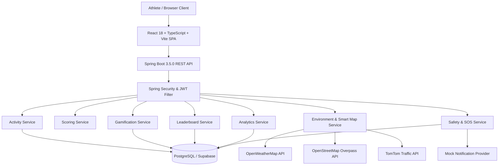
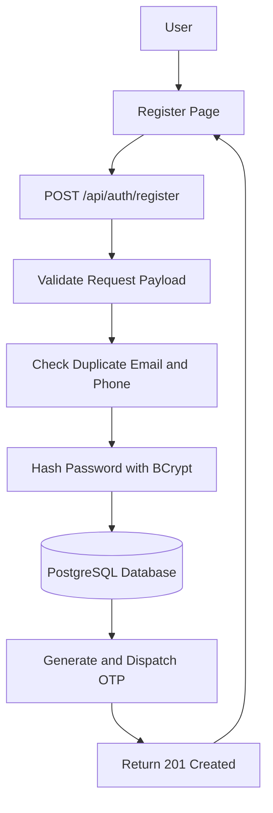
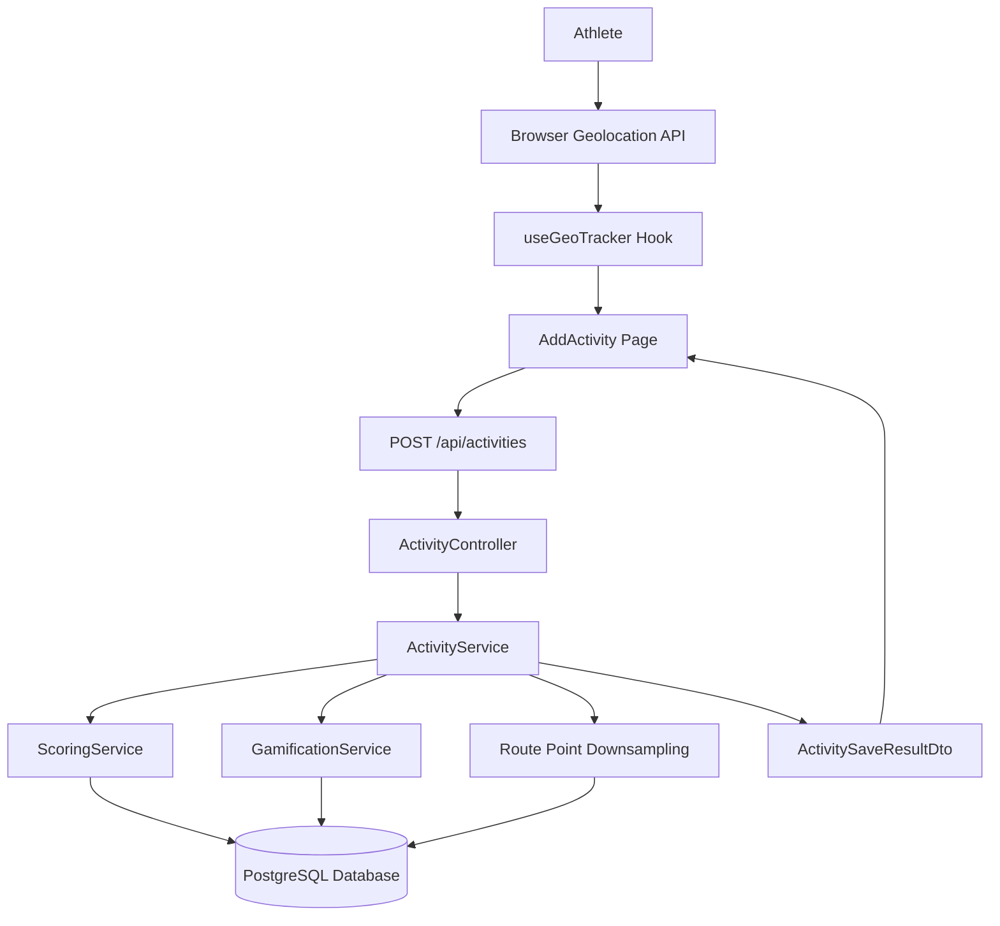
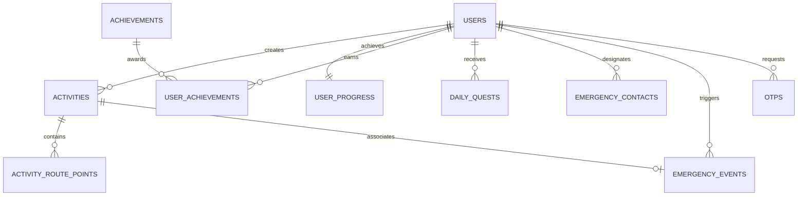

# StrideMate — Software Design Document

**Document Version:** 1.0.0 (Submission Baseline)
**Target Platform:** Full-Stack GPS Athlete Tracking, Gamification, Environmental Intelligence & Safety Ecosystem
**Backend Framework:** Spring Boot 3.5.0 (Java 21 LTS) & Spring Security (Stateless JWT)
**Frontend Framework:** React 18+ (TypeScript, Vite, Tailwind CSS, Leaflet)
**Database:** PostgreSQL (Supabase / In-Memory H2 for Test Isolation)

---

## Executive Summary

**StrideMate** is a full-stack endurance and fitness activity tracking platform. It integrates real-time GPS tracking, velocity-based activity segmentation, algorithmic metric normalization, a deterministic quadratic gamification engine, live environmental microclimate intelligence, OpenStreetMap-powered smart running venue discovery, interactive GPS route playback, and a safe mock emergency SOS safety protocol.

---

## Project Scope — Required Features vs Additional Features

### Required Assignment Features (Evaluation Baseline)
The following core requirements from the project specification are fully implemented, server-authoritative, and verified by automated test suites:

1. **User Registration & Validation:** Implemented in `Register.tsx` and `AuthService.java` (`POST /api/auth/register`). Validates first name, last name, RFC-5322 email format, and password complexity rules (min 8 chars, letter, number, special char).
2. **Activity Data Ingestion:** Implemented in `ActivityController.java` and `ActivityService.java` (`POST /api/activities`). Validates positive distance/duration bounds, auto-populates durations, and executes server-authoritative scoring.
3. **Database / Relational Data Model:** Implemented in PostgreSQL schema with foreign keys, composite indexes, and `ON DELETE CASCADE` referential integrity across users, activities, route points, progress, quests, achievements, and emergency contacts.
4. **Global Leaderboard:** Implemented in `LeaderboardController.java` and `LeaderboardService.java` (`GET /api/leaderboard`). Aggregates total XP, points, and activity counts across All-Time, Weekly, and Monthly time frames.
5. **Personal Dashboard:** Implemented in `Dashboard.tsx` and `DashboardService.java` (`GET /api/dashboard`). Visualizes total distance, active time, calories, current level, progress bar, daily quest cards, and recent workouts.
6. **Authoritative Scoring & Ranking:** Implemented in `ScoringService.java`. Authoritative point calculation for running, walking, cycling, swimming, gym, and steps.
7. **Metric Normalization:** Implemented in `ScoringService.java`. Translates raw durations, distances, and steps into standardized scoring units.
8. **Distance Conversion & Flooring:** Implemented in `ScoringService.java` via `BigDecimal.setScale(0, RoundingMode.FLOOR)`:
   - Running: $\lfloor \text{distanceKm} \times 100 \rfloor$
   - Walking: $\lfloor \text{distanceKm} \times 50 \rfloor$
   - Cycling: $\lfloor \text{distanceKm} \times 25 \rfloor$
9. **Duration Conversion & Flooring:** Implemented in `ScoringService.java`:
   - Swimming: $\lfloor \text{totalSeconds} / 60 \rfloor \times 15$
   - Gym: $\lfloor \text{totalSeconds} / 60 \rfloor \times 5$
10. **100-Step Block Calculation:** Implemented in `ScoringService.java` using integer division `steps / 100 * 1` (strictly flooring to 100-step intervals).
11. **Duplicate User Detection:** Implemented in `AuthService.java` (`userRepository.existsByEmailIgnoreCase`) and enforced via database unique constraints on `public.users(email)` and `public.users(phone_number)`. Returns `409 Conflict`.
12. **Validation & Error Handling:** Implemented in `GlobalExceptionHandler.java`. Handles validation errors, entity not found, access violations, duplicate resources, and invalid coordinates with structured JSON error responses.

---

### Additional StrideMate Features (Implemented Beyond Baseline)

The following features were implemented beyond the core assignment requirements:

1. **Duolingo-Style Gamification:**
   - **XP Progression & Levels:** Deterministic quadratic level curve requiring $50 + 50N$ XP for level $N \to N+1$ (`GamificationService.java`).
   - **Daily Streaks & Consistency Calendar:** Evaluates workouts across UTC calendar days and populates a 7-day consistency ring.
   - **Daily Quests Engine:** Automatically generates 3 personalized quests daily (distance, calorie, point targets) with bonus XP rewards.
   - **Achievement System:** 12 milestone achievement badges (`FIRST_STRIDE`, `STREAK_7`, `MARATHON_DISTANCE`, `CENTURION_100K_STEPS`, etc.).
   - **Celebration Modal:** Interactive level-up and quest completion celebration dialog.
2. **Activity History & Deep Analytics:**
   - Complete activity history with multi-criteria filtering by sport, date, duration, and calories (`ActivityHistory.tsx`).
   - 7-day volume analytics, distance distribution charts, and sport percentage splits (`Analytics.tsx`).
3. **GPS Route Tracking & Replay:**
   - Real-time GPS breadcrumb capture with displacement filtering ($\Delta \ge 5$m, accuracy $\le 25$m).
   - High-frequency coordinate persistence (`ActivityRoutePoint`) with automatic downsampling when coordinates exceed 1,000 points.
   - Interactive Leaflet route viewer with start (green) and finish (red) markers, animated athlete position, and $1\times/2\times/5\times$ speed multipliers (`RouteViewer.tsx`).
4. **Privacy-Safe Social Sharing:**
   - Dynamic branded share cards with workout metrics, map preview, and streak count (`ShareActivityCard.tsx`).
   - Start and finish route privacy trimming to protect home and workplace coordinates.
   - Native Web Share API integration with automatic clipboard fallback.
5. **Smart Running Map:**
   - OpenStreetMap Overpass spatial queries discovering nearby parks, running tracks, and trails within 5 km (`SmartRunningMap.tsx`).
   - Live environmental microclimate integration (AQI, PM2.5, PM10, UV, temperature, humidity, wind).
   - Traffic-aware running suitability score ($0\text{--}100$) and one-click Google Maps navigation.
6. **Emergency Safety / SOS System:**
   - Emergency contacts management with primary contact enforcement (`EmergencyContactService.java`).
   - 1.5-second hold-to-confirm trigger preventing accidental dispatch.
   - High-accuracy GPS coordinate acquisition and strict coordinate bounds validation.
   - 5-minute idempotency guard on `clientRequestId` preventing duplicate alerts.
   - Provider-agnostic architecture operating in safe **MOCK / SIMULATION** mode for evaluation safety.
7. **Profile & Avatar System:**
   - Friendly cartoon animal avatar presets (6 SVG choices).
   - Custom profile image upload supporting secure local disk storage, UUID randomization, and MIME validation.
   - External avatar URL support with immediate Navbar/Profile synchronization.
8. **Unified UI / UX System:**
   - Centralized `StrideLoader` SVG pulse loading animation used across all data views.
   - Light and dark theme switching with persistent localStorage state.
   - Fluid mobile-responsive layout and glassmorphic card design.

---

## Feature Verification Matrix

| Feature | Category | Implementation Component | Status | Notes / Verification Evidence |
| :--- | :--- | :--- | :--- | :--- |
| **User Registration** | `Required` | `Register.tsx`, `AuthService.java` | `WORKING / VERIFIED` | Verified by `AuthControllerTest.java`. Validates duplicate email/phone. |
| **Duplicate User Detection**| `Required` | `AuthService.java`, DB unique constraints | `WORKING / VERIFIED` | Verified by `AuthControllerTest.java`. Returns 409 Conflict. |
| **Activity Ingestion** | `Required` | `AddActivity.tsx`, `ActivityService.java` | `WORKING / VERIFIED` | Verified by `ActivityControllerTest.java` & `RouteAndSafetySprintTest.java`. |
| **Distance Flooring** | `Required` | `ScoringService.java` | `WORKING / VERIFIED` | Verified by `ScoringServiceTest.java`. Floor math with `BigDecimal`. |
| **Duration Flooring** | `Required` | `ScoringService.java` | `WORKING / VERIFIED` | Verified by `ScoringServiceTest.java`. Integer minute division. |
| **100-Step Block Scoring** | `Required` | `ScoringService.java` | `WORKING / VERIFIED` | Verified by `ScoringServiceTest.java`. `steps / 100 * 1`. |
| **Global Leaderboard** | `Required` | `Leaderboard.tsx`, `LeaderboardService.java`| `WORKING / VERIFIED` | Verified by `LeaderboardControllerTest.java`. All/Week/Month views. |
| **Personal Dashboard** | `Required` | `Dashboard.tsx`, `DashboardService.java` | `WORKING / VERIFIED` | Verified by `DashboardControllerTest.java`. |
| **Error Handling** | `Required` | `GlobalExceptionHandler.java` | `WORKING / VERIFIED` | Standardized JSON error response schema. |
| **Live GPS Tracking** | `Extra` | `AddActivity.tsx`, `useGeoTracker.ts` | `WORKING / VERIFIED` | Uses HTML5 Geolocation API with high accuracy mode. |
| **Simulator Mode** | `Extra` | `AddActivity.tsx`, `useGeoTracker.ts` | `WORKING / VERIFIED` | Simulates live jogging telemetry for desktop testing. |
| **Telemetry Segmentation** | `Extra` | `useGeoTracker.ts`, `ScoringService.java` | `WORKING / VERIFIED` | Weighted speed factor partitioning ($w_{\text{walk}}, w_{\text{jog}}, w_{\text{run}}, w_{\text{cycle}}$). |
| **Route Point Persistence** | `Extra` | `ActivityRoutePoint.java`, `ActivityService` | `WORKING / VERIFIED` | Verified by `RouteAndSafetySprintTest.java`. |
| **Leaflet Route Replay** | `Extra` | `RouteViewer.tsx` | `WORKING / VERIFIED` | Interactive timeline scrubber with speed multipliers ($1\times, 2\times, 5\times$). |
| **Privacy Route Trimming** | `Extra` | `ActivityService.java`, `ShareCard.tsx` | `WORKING / VERIFIED` | Verified by `RouteAndSafetySprintTest.java`. Obscures start/end points. |
| **Social Share Cards** | `Extra` | `ShareActivityCard.tsx` | `WORKING / VERIFIED` | Web Share API with clipboard fallback. |
| **XP & Level Progression** | `Extra` | `GamificationService.java` | `WORKING / VERIFIED` | Verified by `GamificationServiceTest.java`. Quadratic curve $25(N-1)(N+2)$. |
| **Streaks & 7-Day Calendar**| `Extra` | `GamificationService.java` | `WORKING / VERIFIED` | Verified by `GamificationServiceTest.java`. Evaluates UTC calendar dates. |
| **Daily Quests Engine** | `Extra` | `GamificationService.java` | `WORKING / VERIFIED` | 3 quests auto-generated daily with reward XP. |
| **Achievements System** | `Extra` | `GamificationService.java` | `WORKING / VERIFIED` | 12 milestone badges with reward XP. |
| **Activity History** | `Extra` | `ActivityHistory.tsx` | `WORKING / VERIFIED` | Filtering by sport, date, calories, duration. |
| **Fitness Analytics** | `Extra` | `Analytics.tsx`, `AnalyticsService.java` | `WORKING / VERIFIED` | Weekly volume and sport breakdown aggregation. |
| **Cartoon Animal Avatars** | `Extra` | `Profile.tsx`, `UserService.java` | `WORKING / VERIFIED` | 6 friendly SVG animal presets. |
| **Profile Photo Upload** | `Extra` | `Profile.tsx`, `UserService.java` | `WORKING / VERIFIED` | Local disk storage (`/uploads/avatars`) with MIME validation. |
| **Unified StrideLoader** | `Extra` | `StrideLoader.tsx` | `WORKING / VERIFIED` | Theme-adaptive SVG polyline animation. |
| **Light & Dark Theme** | `Extra` | `App.tsx`, `index.css` | `WORKING / VERIFIED` | Instant token swapping via CSS variables. |
| **Environmental Weather/AQI**| `Extra`| `EnvironmentService.java` | `IMPLEMENTED — CONFIGURATION REQUIRED` | Live OpenWeather API when key present; deterministic microclimate simulation fallback in dev. |
| **Smart Running Map** | `Extra` | `SmartMapService.java`, `SmartRunningMap`| `IMPLEMENTED — CONFIGURATION REQUIRED` | Live OpenStreetMap Overpass queries for parks; TomTom traffic overlay when key present. |
| **Emergency Contacts CRUD** | `Extra` | `EmergencyContactService.java`, `Safety` | `WORKING / VERIFIED` | Primary contact enforcement; user ownership isolation. |
| **SOS Dispatch (Mock Mode)** | `Extra` | `SafetyService.java`, `MockProvider` | `WORKING / VERIFIED` | Safely simulates SMS delivery (`MOCK_SENT`) without telco costs. |
| **SOS Dispatch (Real Mode)** | `Extra` | `SpringEdgeNotificationProvider.java` | `IMPLEMENTED — CONFIGURATION REQUIRED` | Real SpringEdge REST SMS adapter prepared; inactive in submission mode. |
| **SOS Webhook / DLR Status** | `Extra` | `SafetyController.java`, `SafetyService` | `WORKING / VERIFIED` | Verified by `SpringEdgeSosRealSprintTest.java`. Updates status to `DELIVERED`. |
| **SOS WhatsApp & Voice** | `Extra` | `SpringEdgeNotificationProvider.java` | `IMPLEMENTED — MOCK` | Correctly returns `UNAVAILABLE` when sender unconfigured. |

---

## SOS / Emergency Safety Status (Safe Evaluation Mode)

> [!IMPORTANT]
> ### Safe Evaluation Baseline
> The StrideMate SOS system is implemented as an end-to-end safety workflow and notification-provider abstraction. For this evaluation submission, the system is **intentionally configured in `MOCK / SIMULATED DELIVERY` mode** (`NOTIFICATION_PROVIDER_MODE=mock`).
>
> **Why Real Cellular Dispatch is Disabled by Default:**
> - Real SMS delivery to Indian mobile networks requires an active enterprise gateway subscription, paid credits, and registered DLT (Distributed Ledger Technology) headers/templates per TRAI telecommunications compliance.
> - Operating in mock mode allows evaluators to safely test the complete SOS lifecycle without incurring telco charges or needing external provider credentials.
>
> **The Complete Workflow Operates End-to-End in Mock Mode:**
> 1. **Accidental Trigger Prevention:** Athlete holds the SOS button for **1.5 seconds**, tracked via an animated radial countdown.
> 2. **GPS Coordinate Locking:** Acquires high-accuracy GPS coordinates and validates bounds strictly ($\text{lat} \in [-90, 90]$, $\text{lon} \in [-180, 180]$, no NaN/Infinity).
> 3. **Primary Contact Resolution:** Resolves the athlete's designated primary emergency contact. Fails with `NO_PRIMARY_CONTACT` if missing.
> 4. **Idempotency Guard:** Checks `clientRequestId` within a 5-minute window; returns the existing incident instantly without creating duplicate records.
> 5. **Incident Recording:** Persists an `EmergencyEvent` in PostgreSQL with generated Google Maps link (`https://www.google.com/maps?q={lat},{lon}`).
> 6. **Simulated Delivery Result:** Returns `MOCK_SENT` with simulated message SID (`mock-sms-xxx`), updating the UI badge to `SIMULATED DELIVERY (DEV MOCK)`.
> 7. **Incident History:** The logged emergency event is immediately displayed in the Safety Incident History table.

---

## 1. System Architecture & Data Flow

StrideMate is structured as a client-server architecture with a decoupled Single Page Application (SPA) frontend and a stateless RESTful Spring Boot backend.

### 1.1 High-Level Architecture Diagram



---

### 1.2 User Registration Flow



**Step-by-Step Registration Lifecycle:**
1. The user inputs their first name, last name, email, password, and phone number on the Register page.
2. The frontend sends a `POST /api/auth/register` request with the JSON payload.
3. The backend validates required fields, RFC-5322 email syntax, and password complexity.
4. The backend checks for duplicate email or phone number in PostgreSQL (`userRepository.existsByEmailIgnoreCase`).
5. The password is securely hashed using BCrypt (10 salt rounds).
6. A new user record is persisted in PostgreSQL with `enabled = false` and `email_verified = false`.
7. A 6-digit OTP is generated, hashed, and dispatched to the user's email.
8. The backend returns an `HTTP 201 Created` response, and the frontend transitions to `/verify-otp`.

---

### 1.3 Activity Data Ingestion Flow



**Step-by-Step Ingestion Lifecycle:**
1. The athlete records workout telemetry via live GPS or simulator mode.
2. `useGeoTracker` captures high-accuracy coordinates ($\Delta \ge 5$m, accuracy $\le 25$m) and classifies velocity gait.
3. On completion, the frontend dispatches `POST /api/activities` with duration, distance, velocity breakdown, and route breadcrumbs.
4. `ActivityController` routes the payload to `ActivityService` for input bounds validation.
5. `ScoringService` computes authoritative points and calories using server-side flooring rules.
6. `ActivityRoutePointRepository` batch-persists route points (downsampled if $>1000$ points).
7. `GamificationService` awards XP, computes quadratic level progression, updates UTC streaks, and advances daily quests.
8. The backend returns an `ActivitySaveResultDto` (`HTTP 200 OK`), triggering the level-up celebration modal on the frontend.

---

## 2. Database Schema & Data Model

The relational data model is managed in PostgreSQL with foreign keys, composite indexes, and `ON DELETE CASCADE` referential integrity.

### 2.1 Entity Relationship Diagram



### 2.2 Table Specifications

| Table | Primary Key | Foreign Keys | Key Constraints & Indexes | Cascade Delete Behavior |
| :--- | :--- | :--- | :--- | :--- |
| `public.users` | `id` (UUID) | None | `email` UNIQUE, `phone_number` UNIQUE, `idx_users_email` | — |
| `public.otps` | `id` (UUID) | None | `idx_otps_email`, `idx_otps_created_at` | — |
| `public.activities` | `id` (UUID) | `user_id` $\to$ `users(id)` | `idx_activities_user_id`, `idx_activities_recorded_at` | `ON DELETE CASCADE` |
| `public.activity_route_points` | `id` (UUID) | `activity_id` $\to$ `activities(id)` | `idx_route_points_activity_id`, `idx_route_points_recorded_at` | `ON DELETE CASCADE` |
| `public.user_progress` | `id` (UUID) | `user_id` $\to$ `users(id)` | `user_id` UNIQUE, `idx_user_progress_user_id` | `ON DELETE CASCADE` |
| `public.achievements` | `id` (UUID) | None | `code` UNIQUE | — |
| `public.user_achievements` | `id` (UUID) | `user_id`, `achievement_id` | `UNIQUE(user_id, achievement_id)` | `ON DELETE CASCADE` |
| `public.daily_quests` | `id` (UUID) | `user_id` $\to$ `users(id)` | `UNIQUE(user_id, quest_type, quest_date)` | `ON DELETE CASCADE` |
| `public.emergency_contacts` | `id` (UUID) | `user_id` $\to$ `users(id)` | `idx_emergency_contacts_user_id` | `ON DELETE CASCADE` |
| `public.emergency_events` | `id` (UUID) | `user_id` $\to$ `users(id)`, `activity_id` $\to$ `activities(id)` | `idx_emergency_events_user_id`, `idx_emergency_events_sms_sid`, `idx_emergency_events_client_request_id` | `ON DELETE CASCADE` (user), `ON DELETE SET NULL` (activity) |

### 2.3 Duplicate User Detection Strategy

Duplicate user registration is prevented through a two-tier strategy:

1. **Application Pre-Check Layer (`AuthService.java`):**
   - Normalizes input emails to lowercase trimmed format (`email.trim().toLowerCase()`).
   - Executes `userRepository.existsByEmailIgnoreCase(email)` before saving.
   - Executes `userRepository.existsByPhoneNumber(phone)` to prevent duplicate phone registration.
   - Throws `DuplicateResourceException("Email is already registered.")` mapped to `HTTP 409 Conflict`.
2. **Database Constraint Layer (`supabase_schema.sql`):**
   - Enforces unique constraints directly at the database level:
     ```sql
     CONSTRAINT uq_users_email UNIQUE (email);
     CONSTRAINT uq_users_phone UNIQUE (phone_number);
     ```
   - Any concurrent race condition that bypasses the application check is caught by the database engine and translated into `HTTP 409 Conflict` via `GlobalExceptionHandler.java`.

---

## 3. API Specifications

### 3.1 User Registration API: `POST /api/auth/register`
- **Purpose:** Registers a new athlete and dispatches an OTP.
- **Request Payload:**
  ```json
  {
    "firstName": "Rohan",
    "lastName": "Mehta",
    "email": "rohan.mehta@example.com",
    "password": "SecurePassword123!",
    "phoneNumber": "+919876543210"
  }
  ```
- **Field Validation Rules:**
  - `firstName`, `lastName`: Required, non-blank, max 50 characters.
  - `email`: Required, valid RFC-5322 email string.
  - `password`: Required, minimum 8 characters, at least 1 digit, 1 letter, and 1 special character.
  - `phoneNumber`: Required valid phone number.
- **Success Response (201 Created):**
  ```json
  {
    "email": "rohan.mehta@example.com",
    "message": "Registration successful. Please verify your OTP sent to email."
  }
  ```
- **Error Responses:**
  - `400 Bad Request`: Validation failure (e.g., weak password, malformed email).
  - `409 Conflict`: Email or phone number already registered.

---

### 3.2 Activity Data Ingestion API: `POST /api/activities`
- **Purpose:** Ingests an activity session, computes authoritative points and calories, downsamples route points, and updates gamification progress.
- **Request Payload:**
  ```json
  {
    "sport": "RUNNING",
    "distanceKm": 5.20,
    "durationMinutes": 30,
    "durationSeconds": 0,
    "steps": 6200,
    "totalDurationSeconds": 1800,
    "walkingDurationSeconds": 300,
    "joggingDurationSeconds": 600,
    "runningDurationSeconds": 900,
    "cyclingDurationSeconds": 0,
    "startedAt": "2026-08-18T10:00:00Z",
    "endedAt": "2026-08-18T10:30:00Z",
    "routePoints": [
      { "latitude": 12.9716, "longitude": 77.5946, "accuracy": 4.5, "speed": 2.8, "recordedAt": "2026-08-18T10:00:00Z" },
      { "latitude": 12.9725, "longitude": 77.5955, "accuracy": 3.8, "speed": 3.4, "recordedAt": "2026-08-18T10:05:00Z" }
    ]
  }
  ```
- **Validation Rules:**
  - `sport`: Must be one of `RUNNING`, `WALKING`, `CYCLING`, `SWIMMING`, `GYM`, `DAILY_STEPS`.
  - `distanceKm`: Must be positive if provided.
  - `durationMinutes` / `totalDurationSeconds`: Must be positive.
- **Success Response (200 OK):**
  ```json
  {
    "activity": {
      "activityId": "a1b2c3d4-e5f6-7890-abcd-ef1234567890",
      "sport": "RUNNING",
      "distanceKm": 5.20,
      "points": 500,
      "calories": 365,
      "recordedAt": "2026-08-18T10:30:00Z"
    },
    "pointsEarned": 500,
    "xpEarned": 500,
    "currentXp": 1250,
    "totalXp": 2450,
    "level": 6,
    "levelUp": true,
    "currentStreak": 4,
    "longestStreak": 7,
    "completedQuests": [],
    "unlockedAchievements": []
  }
  ```
- **Error Responses:**
  - `400 Bad Request`: Non-positive distance or duration.
  - `401 Unauthorized`: Missing or invalid Bearer JWT token.

---

### 3.3 Supporting Core Endpoints

| Method | Route | Description |
| :--- | :--- | :--- |
| `GET` | `/api/dashboard` | Returns athlete stats, current level, progress, 7-day consistency calendar, and recent activities. |
| `GET` | `/api/leaderboard?timeFrame=ALL_TIME` | Returns ranked athletes by XP (`ALL_TIME`, `WEEKLY`, `MONTHLY`). |
| `GET` | `/api/activities/{id}/route?privacy=true` | Returns GPS route breadcrumbs with optional start/finish privacy trimming. |
| `POST`| `/api/safety/sos` | Dispatches emergency SOS workflow in mock mode. |
| `GET` | `/api/safety/mode` | Returns notification provider mode (`mock` vs `real`) without exposing secrets. |

---

### 3.4 API Error Handling & Structured Response Schema

Centralized in [`GlobalExceptionHandler.java`](file:///C:/StrideMate/backend/src/main/java/com/stridemate/api/exception/GlobalExceptionHandler.java):

```json
{
  "timestamp": "2026-08-18T11:15:30Z",
  "status": 400,
  "error": "Bad Request",
  "message": "NO_PRIMARY_CONTACT: No primary emergency contact configured.",
  "path": "/api/safety/sos"
}
```

---

## 4. Scoring & Normalization Logic

Authoritative scoring calculations are executed strictly server-side in [`ScoringService.java`](file:///C:/StrideMate/backend/src/main/java/com/stridemate/api/scoring/ScoringService.java).

### 4.1 Metric Conversions & Flooring Rules

#### A. Distance-Based Scoring (Flooring to Integer Points)
Calculated via `BigDecimal.setScale(0, RoundingMode.FLOOR)`:
- **Running:** $\lfloor \text{distanceKm} \times 100 \rfloor$ points ($1\text{ km} = 100\text{ pts}$)
- **Walking:** $\lfloor \text{distanceKm} \times 50 \rfloor$ points ($1\text{ km} = 50\text{ pts}$)
- **Cycling:** $\lfloor \text{distanceKm} \times 25 \rfloor$ points ($1\text{ km} = 25\text{ pts}$)

#### B. Duration-Based Scoring (Flooring Completed Minutes)
Calculated via integer division `totalSeconds / 60`:
- **Swimming:** $\left\lfloor \frac{\text{totalSeconds}}{60} \right\rfloor \times 15$ points ($1\text{ min} = 15\text{ pts}$)
- **Gym Workouts:** $\left\lfloor \frac{\text{totalSeconds}}{60} \right\rfloor \times 5$ points ($1\text{ min} = 5\text{ pts}$)

#### C. Step-Based Scoring (100-Step Blocks)
Calculated via integer division `steps / 100 * 1`:
- **Daily Steps:** $\left\lfloor \frac{\text{steps}}{100} \right\rfloor \times 1$ point ($100\text{ steps} = 1\text{ pt}$)

---

### 4.2 Telemetry Auto-Segmented Scoring
When an outdoor workout contains mixed velocities (walking, jogging, running, cycling), the total distance is dynamically partitioned across the segments using weighted speed factors:

$$w_{\text{walk}} = t_{\text{walk}} \times 4.5, \quad w_{\text{jog}} = t_{\text{jog}} \times 8.0, \quad w_{\text{run}} = t_{\text{run}} \times 12.0, \quad w_{\text{cycle}} = t_{\text{cycle}} \times 20.0$$
$$w_{\text{total}} = w_{\text{walk}} + w_{\text{jog}} + w_{\text{run}} + w_{\text{cycle}}$$
$$d_{\text{segment}} = \text{distanceKm} \times \left(\frac{w_{\text{segment}}}{w_{\text{total}}}\right)$$
$$\text{Total Points} = \lfloor d_{\text{walk}} \times 50 \rfloor + \lfloor d_{\text{jog}} \times 100 \rfloor + \lfloor d_{\text{run}} \times 100 \rfloor + \lfloor d_{\text{cycle}} \times 25 \rfloor$$

---

### 4.3 Calorie Formulas
$$\text{Calories}_{\text{Segmented}} = \text{round}\left( \frac{t_{\text{walk}}}{60} \times 4.5 + \frac{t_{\text{jog}}}{60} \times 8.5 + \frac{t_{\text{run}}}{60} \times 12.0 + \frac{t_{\text{cycle}}}{60} \times 8.0 \right)$$
$$\text{Calories}_{\text{Running Default}} = \text{round}(\text{distanceKm} \times 65.0)$$
$$\text{Calories}_{\text{Walking Default}} = \text{round}(\text{distanceKm} \times 45.0)$$
$$\text{Calories}_{\text{Cycling Default}} = \text{round}(\text{distanceKm} \times 30.0)$$
$$\text{Calories}_{\text{Gym Default}} = \text{round}\left(\frac{\text{totalSeconds}}{60} \times 6.0\right)$$
$$\text{Calories}_{\text{Swimming Default}} = \text{round}\left(\frac{\text{totalSeconds}}{60} \times 10.0\right)$$
$$\text{Calories}_{\text{Steps Default}} = \text{round}(\text{steps} \times 0.04)$$

---

### 4.4 Deterministic Quadratic Level Curve
Implemented in [`GamificationService.java`](file:///C:/StrideMate/backend/src/main/java/com/stridemate/api/gamification/service/GamificationService.java). Each level $N \to N+1$ requires an additional $50 + (N \times 50)$ XP:

$$\text{Cumulative XP for Level } N = \sum_{i=1}^{N-1} (50 + 50i) = 25(N-1)(N+2)$$

| Level | Cumulative XP Required | XP Delta to Next Level |
| :--- | :--- | :--- |
| **Level 1** | $0\text{ XP}$ | $100\text{ XP}$ |
| **Level 2** | $100\text{ XP}$ | $150\text{ XP}$ |
| **Level 3** | $250\text{ XP}$ | $200\text{ XP}$ |
| **Level 4** | $450\text{ XP}$ | $250\text{ XP}$ |
| **Level 5** | $700\text{ XP}$ | $300\text{ XP}$ |
| **Level 10** | $2,700\text{ XP}$ | $550\text{ XP}$ |

---

## 5. Frontend Architecture & Visualizations

### 5.1 Personal Dashboard Breakdown (`Dashboard.tsx`)
- **Metric Cards:** Distance (km), Active Time (formatted hours/minutes), Calories Burned (kcal), and Point Balance.
- **Level & Progression HUD:** Displays current level badge, progress bar, current XP, and XP remaining for the next level.
- **7-Day Consistency Calendar:** Visualizes workout frequency across the past 7 UTC days with completed rings and streak indicators.
- **Daily Quests Hub:** Dynamic quest cards displaying progress bars (`targetValue` vs `currentValue`), reward XP chips, and completion ticks.
- **Recent Activities Feed:** Chronological list of recent workouts with sport badges, distance, points, and timestamps.

### 5.2 Global Leaderboard Breakdown (`Leaderboard.tsx`)
- **Time Frame Switching:** Tabs for **All-Time**, **This Week** (current UTC week), and **This Month** (current UTC month).
- **Ranking Calculation Strategy:** The backend executes SQL aggregations over the selected time window, ordering athletes by `totalXp DESC, totalDistance DESC`. The frontend assigns podium medal badges (🥇 Gold, 🥈 Silver, 🥉 Bronze) for ranks 1–3, highlights the current user's rank row, and displays rank number, avatar, athlete name, level badge, activity count, distance, and total XP.

### 5.3 Route Replay & Map Visualization (`RouteViewer.tsx`)
- Powered by Leaflet and OpenStreetMap tiles.
- Renders start marker (green pin), finish marker (red pin), and SVG polyline trace.
- Interactive timeline scrubber with speed playback multiplier ($1\times, 2\times, 5\times$) that animates an athlete dot along the recorded route.

### 5.4 Unified StrideLoader (`StrideLoader.tsx`)
- Custom theme-adaptive SVG polyline animation representing an active pulse wave.
- Used across Dashboard, Activity History, Leaderboard, Smart Map, and Safety views to provide a consistent loading experience.

---

## 6. Trade-offs & Edge Cases Handled

1. **Concurrent SOS Submissions & Network Flapping:** Handled via a **5-minute idempotency guard** keyed by `clientRequestId`. If a user taps the SOS button multiple times or the client retries over a weak connection, the backend returns the existing incident without creating duplicates.
2. **Invalid GPS Coordinates & Telemetry Injection:** Handled in `SafetyService.java` by validating coordinate ranges ($\text{lat} \in [-90, 90]$, $\text{lon} \in [-180, 180]$, no NaN or Infinity) and rejecting non-positive distance values.
3. **GPS Stationary Jitter:** Handled in `useGeoTracker.ts` by filtering out GPS fixes with accuracy $>25$ meters and enforcing a minimum 5-meter displacement threshold before accumulating distance.
4. **GPS Route Downsampling:** High-frequency logging over long workouts can generate thousands of points. `ActivityService.java` downsamples routes exceeding 1,000 coordinates before persistence to conserve database bandwidth and memory.
5. **Social Sharing Privacy:** Sharing exact workout maps can reveal residential or workplace locations. `ActivityService.java` provides a `?privacy=true` mode that trims the outer 10% of coordinates at the start and finish of the route.
6. **Mobile Geolocation Over Plain HTTP:** Mobile Chrome disables the Geolocation API over unencrypted HTTP LAN IPs (`192.168.x.x`). Handled by detecting insecure origins and offering **Simulator Mode** or developer flag instructions.

---

## 7. Security Considerations

1. **Stateless JWT Architecture:** Bearer tokens verified on each request via `JwtAuthenticationFilter` with 24-hour expiration.
2. **Password Protection:** Passwords hashed with BCrypt (10 salt rounds).
3. **CORS Governance:** Configured in `SecurityConfig.java` to support local dev ports, private LAN subnets (`http://192.168.*:*`), and production Vercel domains (`https://*.vercel.app`).
4. **Avatar File Upload Validation:** Enforces a 5 MB max size, strict MIME type validation (`image/jpeg`, `image/png`, `image/webp`), UUID filename randomization, and path traversal protection.
5. **User Isolation:** All database queries for activities, route points, progress, and emergency contacts are partitioned by authenticated user ID (`user.getId()`).

---

## 8. Known Limitations

1. **Browser-Based Background GPS:** Mobile browsers (iOS Safari, Android Chrome) throttle JavaScript execution and GPS polling when the screen is locked. Native continuous background tracking requires a native app wrapper (e.g., Capacitor).
2. **Indian Cellular DLT Compliance:** Live SpringEdge SMS delivery to Indian mobile numbers requires an active TRAI DLT header registration and approved message templates.
3. **Local File Storage:** Uploaded avatar photos are stored on the local server disk (`/uploads/avatars`). Production environments with ephemeral containers require cloud object storage (e.g., AWS S3 / Supabase Storage).

---

## 9. Local Development & Installation Guide

### 9.1 Prerequisites
- **JDK 21 LTS** installed and configured on `PATH`
- **Apache Maven 3.9+**
- **Node.js v18+ LTS** and `npm`

### 9.2 Backend Startup
```bash
cd backend
mvn spring-boot:run
```
*Backend runs at `http://localhost:8080` with in-memory H2 database enabled by default.*

### 9.3 Frontend Startup
```bash
cd frontend
npm install
npm run dev
```
*Frontend runs at `http://localhost:5173`.*

---

## 10. Testing & Verification

```bash
# Execute full backend test suite (102 tests)
cd backend
mvn clean test

# Execute frontend TypeScript check & production build
cd ../frontend
npm run build
```

**Verification Results:**
- **Backend Tests:** **102 / 102 passed** (0 failures, 0 errors, 0 skipped).
- **Frontend Build:** Clean compilation with **0 TypeScript errors**.
